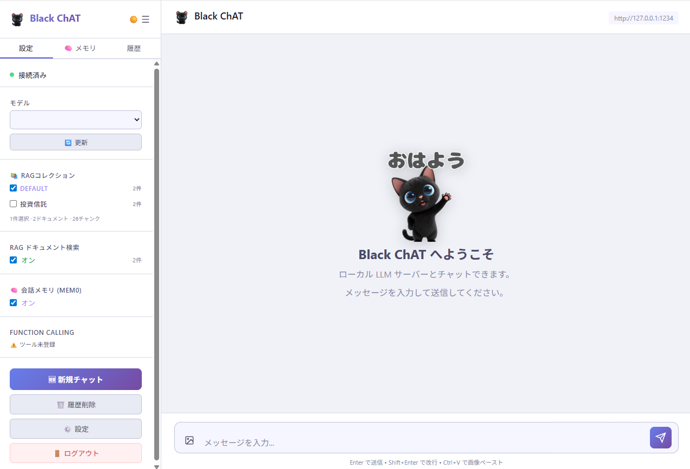
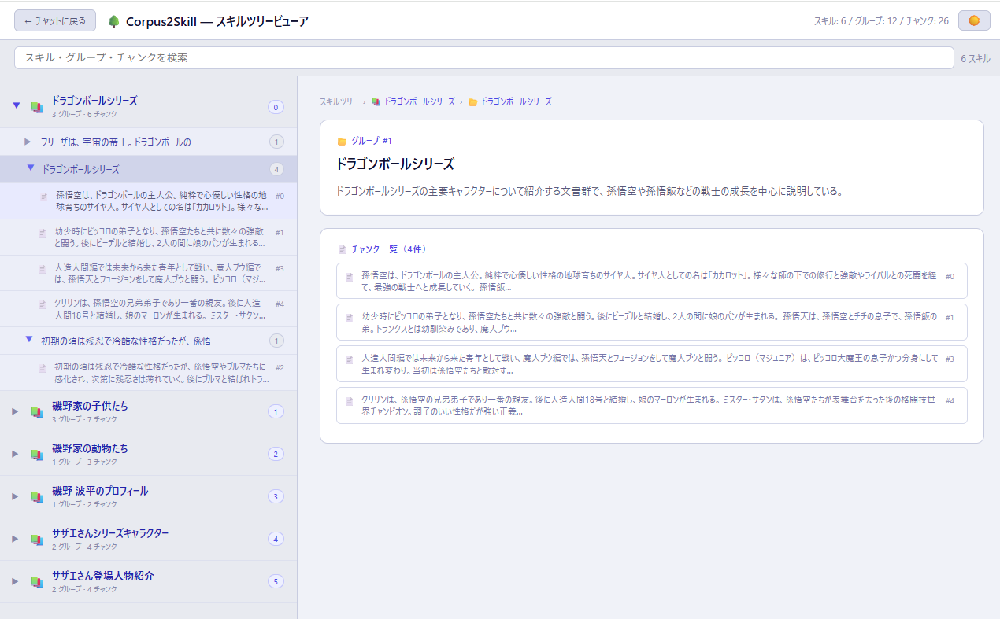
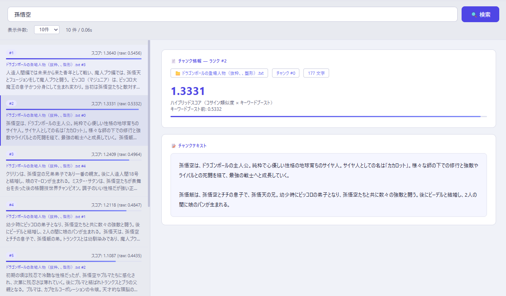

# Black ChAT — Corpus2Skill

LM Studio / Ollama のローカル LLM に接続するチャットアプリです。  
独自の階層型 RAG システム **Corpus2Skill** と、会話を記憶する **mem0 メモリ機能** を搭載しています。

---

## スクリーンショット

### チャット画面


ツール呼び出し（Function Calling）と RAG によるコンテキスト付き会話ができます。  
サイドバーでモデルの切り替えや RAG / メモリの有効・無効を管理できます。  
ライト / ダークモードの切替に対応しています。

---

### スキルツリービューア


RAG コーパスから自動生成されたスキルツリーを階層的に閲覧できます。  
スキル → グループ → チャンク の 3 段階で構造が可視化され、チャンクを選択するとテキスト全文を確認できます。

---

### RAG 検索テスト


クエリを入力してリアルタイムにチャンク検索が行えます。  
コサイン類似度スコアとスコアバーで各チャンクの関連度を視覚的に確認できます。

---

## 主な機能

| 機能 | 説明 |
|------|------|
| 💬 ストリーミングチャット | SSE によるリアルタイムストリーミング応答 |
| 🔧 Function Calling | MCP 経由のツール呼び出し |
| 📚 Corpus2Skill RAG | テキストコーパスから階層型スキルツリーを自動構築 |
| 🔎 ハイブリッド検索 | コサイン類似度 + キーワードブーストによる再ランキング |
| 🌳 スキルツリービューア | RAG の内部構造を視覚的に確認 (`/skill-tree`) |
| 🔍 RAG 検索テスト | クエリのベクトル検索とスコア確認 (`/rag-search`) |
| ⚙️ バックグラウンドコンパイル | コーパス追加時に非同期でスキルツリーを構築・進捗表示 |
| 🗑️ ドキュメント個別削除 | 登録済みコーパスをドキュメント単位で削除 |
| 🗂️ マルチコレクション | RAG コーパスを複数コレクションに分けて管理・横断検索 |
| 🛠️ スキル設定 UI | スキル数・グループ数・チャンク文字数をブラウザから調整・再コンパイル |
| 🧠 会話メモリ (mem0) | 会話内容をセッションをまたいで記憶し、次回の応答に自動反映 |
| 🖼️ 画像アップロード (VLM) | チャットに画像を添付して VLM と会話。クリップボードペーストにも対応 |
| 🌙 ライト / ダークモード | 全画面でテーマ切替可能。設定は `localStorage` で永続化 |
| 🦙 Ollama 対応 | `.env` の `BACKEND_TYPE` を変えるだけで LM Studio ↔ Ollama を切替 |

---

## 会話メモリ機能 (mem0)

[mem0](https://github.com/mem0ai/mem0) を使った永続メモリ機能です。チャットのたびにユーザーの発言と AI の回答を自動的に保存し、次回以降の会話で関連する記憶をシステムプロンプトへ注入します。

### 動作フロー

```
チャット送信
    │
    ▼  mem0 で過去の関連メモリを検索（ベクトル類似度）
    │    ※ ユーザー発言・AI 回答の両方が検索対象
    │
    ▼  ヒットしたメモリを [ユーザー] / [AI] ロールラベル付きで
    │  システムプロンプトに注入
    │
    ▼  LM Studio / Ollama へ送信 → 応答取得
    │
    ▼  今回の会話（質問＋回答）をメモリに保存
```

注入されるプロンプトの例：

```
【会話の記憶】
- [ユーザー] ベジータについて教えてください
- [AI] ベジータはサイヤ人の王子で誇り高い戦士です。フリーザ軍に属し...
- [ユーザー] 悟空と戦ったのはいつですか？
```

### 特徴

- **ローカル完結** — 埋め込みは SentenceTransformer、ベクトルストアは Qdrant（ローカルファイル）を使用。外部 API は不要
- **LLM 非依存の保存方式** (`infer=False`) — ローカルモデルの JSON 出力能力に依存せず、会話テキストをそのまま埋め込んで保存するため、どのモデルでも確実に動作
- **ユーザー・AI 双方を記憶** — 質問だけでなく AI の回答も記憶するため、LLM が「どんな会話をしたか」まで把握できる
- **ロールラベル付き注入** — `[ユーザー]` / `[AI]` ラベル付きでプロンプトに渡すため、発話者が明確
- **メモリソース表示** — 使用したメモリ項目が回答下に紫タグで表示される（RAGソース表示と同様）
- **セッションをまたいだ記憶** — ログインし直してもメモリは保持される
- **メモリタブで管理** — サイドバーの「🧠 メモリ」タブで蓄積済みメモリの一覧表示・個別削除・全削除が可能

### 設定

| 環境変数 | デフォルト | 説明 |
|---------|-----------|------|
| `C2S_EMBED_MODEL` | `sentence-transformers/paraphrase-multilingual-MiniLM-L12-v2` | 埋め込みモデル（RAG と共有） |

> **注意**: 埋め込みモデルを変更した場合は `mem0_db/` フォルダを削除してサーバーを再起動してください（次元数不一致エラーを防ぐため）。

---

## 画像アップロード機能 (VLM 対応)

LLaVA・Qwen2-VL・Phi-3.5-Vision・Gemma3・InternVL2 などの VLM（Vision Language Model）をロードすることで、チャット内で画像について質問できます。

### 使い方

| 操作 | 方法 |
|------|------|
| 画像を添付 | 入力欄左の 🖼️ ボタンをクリックしてファイル選択（複数枚可） |
| クリップボードから貼り付け | チャット画面で `Ctrl+V` |
| プレビュー確認 | 入力欄上にサムネイルが表示される。✕ ボタンで除外可能 |
| 送信後の確認 | バブル内にサムネイルが表示され、クリックすると拡大表示 |

### 技術仕様

- **送信フォーマット**: OpenAI Vision API 互換の multimodal content 配列  
  `[{type:"text", text:"..."}, {type:"image_url", image_url:{url:"data:image/...;base64,..."}}]`
- **RAG・メモリ・履歴保存**: テキスト部分のみを抽出して処理（`_extract_text_content()` ヘルパー）
- **会話継続**: バブルの DOM に multimodal JSON を保存し、後続ターンでも画像が正しくコンテキストに含まれる
- **対応 VLM 例**: LLaVA / Qwen2-VL / Phi-3.5-Vision / Gemma3 / InternVL2 / Moondream / Pixtral / MiniCPM-V

> **注意**: テキスト専用モデルに画像を送ると API エラーが発生することがあります。VLM をロードした状態で使用してください。

---

## Corpus2Skill について

Corpus2Skill は、テキストコーパスを **スキルツリー** として構造化する独自の階層型 RAG システムです。

```
コーパス（テキストファイル群）
    │
    ▼  SentenceTransformer でチャンク化＋埋め込み
    │    ※ チャンクのオーバーラップは文末（。！？）で境界を揃える
    │
    ▼  K-means クラスタリング（第 1 層: スキル）
    │
    ▼  各スキル内でさらに K-means（第 2 層: グループ）
    │
    ▼  LLM でスキル名・グループ名・トピックを自動生成
    │
    ▼  スキルツリー完成
    │
    ▼  検索: コサイン類似度 × キーワードブーストで再ランキング
```

### ハイブリッド検索

純粋なコサイン類似度だけでは固有名詞・専門用語のマッチが弱い場合があるため、**キーワードブースト**を併用して精度を改善しています。

- クエリと完全一致するテキストのスコアを 2.5 倍にブースト
- 部分一致（単語単位）の場合は一致率に応じて 1.0〜2.5 倍の間で線形補間
- 候補を 60 件（表示数 12 の 5 倍）取得してから再ランキング → 上位 12 件を返す

### パラメータ

| パラメータ | デフォルト | 説明 |
|-----------|-----------|------|
| `max_top_skills` | 6 | 第 1 層のスキル数 |
| `branching_factor` | 4 | 各スキル内のグループ数 |
| `chunk_max_chars` | 800 | 1 チャンクの最大文字数 |
| `overlap_chars` | 0 | チャンク間のオーバーラップ文字数（文末境界で揃える）|

---

## 必要環境

- **Python 3.11+**（[uv](https://docs.astral.sh/uv/) 推奨）
- **LM Studio** または **Ollama** — ローカルで LLM を起動しておく
- **MCP サーバー**（任意） — Function Calling を使う場合

---

## セットアップ

### 1. リポジトリのクローン

```bash
git clone https://github.com/TakkunRed/Black-ChAT.git
cd Black-ChAT
```

### 2. 依存パッケージのインストール

```bash
uv sync
```

### 3. 環境変数の設定

`.env` ファイルをプロジェクトルートに作成します。

```env
# バックエンド種別: lmstudio（デフォルト）または ollama
BACKEND_TYPE=lmstudio

# LLM サーバーのホスト・ポート
# LM Studio デフォルト: 1234 / Ollama デフォルト: 11434
LM_STUDIO_HOST=127.0.0.1
LM_STUDIO_PORT=1234

# API キー（LM Studio は任意、Ollama は不要）
LM_STUDIO_API_KEY=lm-studio

# アプリのログイン情報
APP_USERNAME=admin
APP_PASSWORD=password

# 埋め込みモデル（RAG + mem0 で共通使用）
C2S_EMBED_MODEL=sentence-transformers/paraphrase-multilingual-MiniLM-L12-v2
```

### 4. アプリの起動

```bash
uv run python main.py
```

ブラウザで `http://localhost:8021` を開きます。

#### Ollama で使う場合

`.env` の `BACKEND_TYPE` と `LM_STUDIO_PORT` を変更するだけです。

```env
BACKEND_TYPE=ollama
LM_STUDIO_PORT=11434
```

---

## 使い方

### コーパスの登録

1. サイドバーの **設定（⚙️）** を開く
2. **RAGドキュメント** セクションでテキストファイル（`.txt` / `.md` / `.pdf` / `.docx`）をアップロード
3. アップロード後、バックグラウンドでスキルツリーのコンパイルが始まります（進捗バーで確認）

### RAG チャット

- サイドバーの **RAG** トグル（デフォルト ON）でチャットにコンテキストを付与します
- 回答の下に参照したソースが **📄 参照** タグで表示されます

### 会話メモリの使い方

- サイドバーの **🧠 会話メモリ** トグル（デフォルト ON）で有効になります
- チャットするたびに質問と回答が自動保存され、次回以降の会話に反映されます
- 回答の下に使用したメモリが **🧠 メモリ** タグで表示されます（ロール付き）
- **🧠 メモリ** タブでメモリ一覧を確認・削除できます
- メモリをリセットしたい場合は「🗑️ 全削除」ボタンを使用してください

### スキルツリーの確認

- サイドバーの **🌳 スキルツリービューア** ボタン、または `/skill-tree` を直接開きます
- ツリーをクリックしてスキル→グループ→チャンクを展開できます
- 検索バーでキーワードフィルタリングも可能です

### RAG 検索のテスト

- 設定の **🔍 RAG 検索テスト** ボタン、または `/rag-search` を直接開きます
- クエリを入力して **検索** を押すと、ハイブリッドスコア順にチャンクが表示されます

### スキル設定の調整

設定モーダルの **スキルツリー設定** で以下を変更できます：

- **スキル数**（`max_top_skills`）: コーパスを何個の大分類にまとめるか
- **グループ数**（`branching_factor`）: 各スキルを何個のサブグループにまとめるか
- **チャンク文字数**（`chunk_max_chars`）: 1チャンクに含める最大文字数
- **オーバーラップ**（`overlap_chars`）: チャンク間の重複文字数（文末で境界を揃える）

変更後は **🔄 再コンパイル** ボタンを押してスキルツリーを再構築します。

### 画像を添付して VLM と会話

1. LM Studio または Ollama で VLM（LLaVA / Qwen2-VL など）をロードしてモデルを選択
2. 入力欄左の 🖼️ ボタンで画像を選択、または `Ctrl+V` でクリップボードから貼り付け
3. テキストメッセージと一緒に送信すると、VLM が画像を認識して回答します

### テーマの切替

各画面のヘッダーまたはサイドバーにある **🌙 / ☀️** ボタンでライト / ダークモードを切り替えられます。設定は全画面で共有されます。

---

## ディレクトリ構成

```
LMStudio-Chat-Corpus2Skill/
├── main.py                  # FastAPI アプリ本体
├── rag.py                   # Corpus2Skill RAG エンジン
├── config.py                # バックエンド設定（LM Studio / Ollama 切替）
├── static/
│   ├── style.css            # グローバルスタイル（ライト/ダーク CSS 変数）
│   └── img/                 # アイコン・ウェルカム猫画像
│       ├── 00.png           # AI アイコン
│       ├── 01.png           # 朝のウェルカム画像（05:00〜11:59）
│       ├── 05.png           # 昼のウェルカム画像（12:00〜19:59）
│       └── 18.png           # 夜のウェルカム画像（20:00〜04:59）
├── templates/
│   ├── chat.html            # チャット UI
│   ├── skill_tree.html      # スキルツリービューア
│   └── rag_search.html      # RAG 検索テスト UI
├── c2s_db/                  # RAG データ（自動生成）
│   └── <コレクション名>/
│       ├── chunk_index.json
│       ├── skill_meta.json
│       ├── embeddings.npy
│       └── skills/
│           └── skill_XX_topic/
│               └── group_XX_sub/
│                   ├── SKILL.md
│                   ├── INDEX.md
│                   └── chunk_ids.json
├── mem0_db/                 # メモリ用 Qdrant DB（自動生成）
├── rag_docs/                # アップロードしたコーパスファイル（自動生成）
├── images/                  # README 用スクリーンショット
├── .env                     # 環境変数（要作成）
└── README.md
```

> **RAG データの完全リセット**: `c2s_db/` フォルダを削除するか、設定モーダルの **🗑️ 全クリア** ボタンを使用してください。  
> **メモリの完全リセット**: `mem0_db/` フォルダを削除するか、サイドバーの「🧠 メモリ」タブの **🗑️ 全削除** ボタンを使用してください。

---

## 技術スタック

| コンポーネント | 技術 |
|--------------|------|
| Web フレームワーク | [FastAPI](https://fastapi.tiangolo.com/) + [Starlette](https://www.starlette.io/) |
| ストリーミング | Server-Sent Events (SSE) |
| LLM クライアント | [httpx](https://www.python-httpx.org/) (async streaming) |
| 埋め込みモデル | [SentenceTransformer](https://www.sbert.net/) (`paraphrase-multilingual-MiniLM-L12-v2`) |
| クラスタリング | scikit-learn K-means |
| LLM バックエンド | [LM Studio](https://lmstudio.ai/) / [Ollama](https://ollama.com/)（OpenAI 互換 API） |
| ツール呼び出し | MCP (Model Context Protocol) |
| 会話メモリ | [mem0ai](https://github.com/mem0ai/mem0) + Qdrant（ローカルファイルモード） |
| 画像入力 | OpenAI Vision API 互換フォーマット（VLM ロード時に有効） |

---

## ライセンス

MIT
